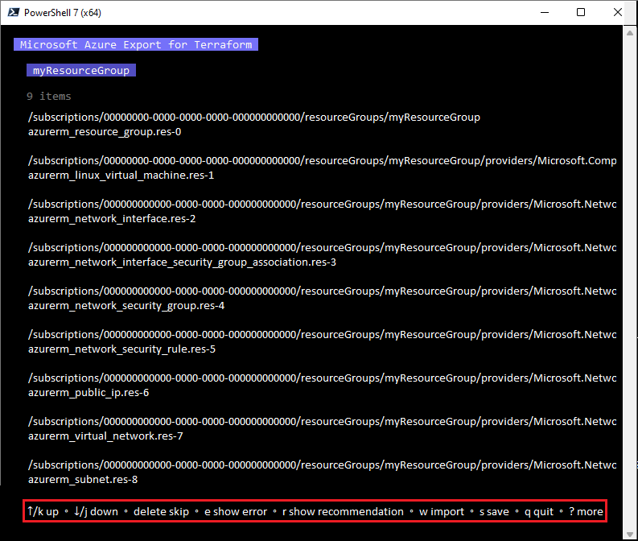

In this guide, we're going to export some resources from Azure into OpenTofu using [Azure Export for Terraform](https://learn.microsoft.com/en-us/azure/developer/terraform/azure-export-for-terraform/export-terraform-overview). Azure Export for Terraform (`aztfexport`) is a tool that allows you to export your Azure resources into Terraform configuration files (`.tf`). `aztfexport` enables you to:

- Simplify migration to OpenTofu on Azure by using a single command to migrate your resources.
- Export user-specified resources to HCL code and state. `aztfexport` enables you to specify a predetermined scope, which can be a subscription, resource group, or resource.
- Inspect your preexisting resources with all properties exposed using `aztfexport`'s read-only option to expose all configurable properties.
- Follow plan/apply workflow to migrate resources to OpenTofu. Export the HCL code and state, inspect the resources, and effortlessly integrate them into your production environment and remote backends.

## Prerequisites

- [Setup completed](../setup/README.md)
- [Azure Export for Terraform](https://github.com/azure/aztfexport?tab=readme-ov-file#install)

## Configuration and usage

By default, `aztfexport` collects telemetry data, which Microsoft aggregates to identify trends and usage patterns. To disable telemtry, run:

```bash
aztfexport config set telemetry_enabled false
```

The basic commands for `aztfexport` are:
| Command | Description |
|---------|-------------|
| `aztfexport resource [option] <resource id>` | Export a single resource using the Azure resource ID |
| `aztfexport resource-group [option] <resource group name>` | Export all resources in a resource group using the resource group name (not ID) |
| `aztfexport query True` | Exports all resources in the subscription |
| `aztfexport query [option] <ARG where predicate>` | Export resources using an Azure Resource Graph query |

## Test run

`aztfexport` supports interactive and non-interactive modes. This guide will be using interactive mode. For non-interactive mode, append `--non-interactive` to the command.

1. Create a new test directory to store the exported resources and `cd` into it.
2. Create a test resource to export using the Azure CLI:

```bash
az group create --name tofu-export-test --location westus
```

```bash
az vm create --resource-group tofu-export-test --name tofu-export-test-vm --image UbuntuLTS --admin-username azureuser --generate-ssh-keys --image Debian11 --public-ip-sku Standard
```

3. Export the resource group using `aztfexport`:

```bash
aztfexport resource-group tofu-export-test
```

After the tool initializes (may take a few minutes), a list of resources to be exported is displayed. Each line will have an Azure resource ID matched to the resource type. There is a list of commands on the bottom of the screen.



- &#8593; and &#8595; arrows to navigate the list
- `delete` key will skip the resource so it is not exported
- `w` to run the export
- `s` to save
- `q` to quit

4. Press `w` to run the export.
5. Once the export is finished, exit the tool by pressing any key.
6. View the exported resources in your new directory using `ls`. You should see the following files:

- `aztfexportResourceMapping.json` - A mapping of Azure resource IDs to Terraform resource names
- `main.tf` - Contains all of your Azure resources that were exported
- `provider.tf` - Contains the provider configuration for `azurerm`
- `terraform.tf` - Initializes the `azurerm` provider and local state backend, and pins the version
- `terraform.tfstate` - Contains the state of the exported resources

7. Review the exported resources and make any necessary changes.
8. Run `tofu init --upgrade` then `tofu plan`. If the terminal outputs **No changes. Your infrastructure matches the configuration.** then congratulations! You have successfully exported your resources and its state to Terraform.

## Cleanup

1. Navigate to your test directory.
2. Run `tofu destroy` then enter `yes` to the prompt to remove the resources from Azure.
